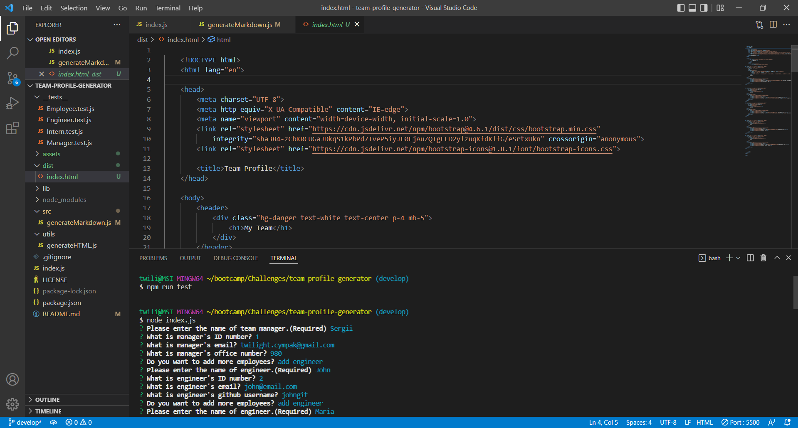
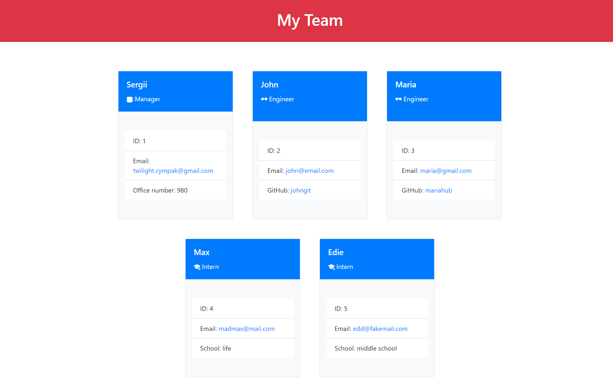

# Team Profile Generator

## Description
- I was motivated to create team profile generator to improve knowledge I've got in Object-Oriented Programming and Creating Tests
- I build this project because that's nice way to show my skills on the level I reach.
- It solves the problem fast creating html page with information about whole team.
- I have learned Object-Oriented Programming and Creating Tests.

## Table of Contents

- [Installation](#installation)
- [Usage](#usage)
- [Credits](#credits)
- [License](#license)

## Installation

To install the project you need to run terminal in main folder and type "npm i" to install on necesary packages from package.json and then type "node index.js" which will run index.js file in NodeJS. After answer the questions and in the end you wiil get created index.html file in "dist" folder.

## Usage

Screenshots and gif: 

## Credits

## License

[Link to license: MIT](https://opensource.org/licenses/MIT)

## Questions

Here is link to my GitHub profile page: https://github.com/sergiionyx

And also you may contact me via e-mail: twilight.cympak@gmail.com
